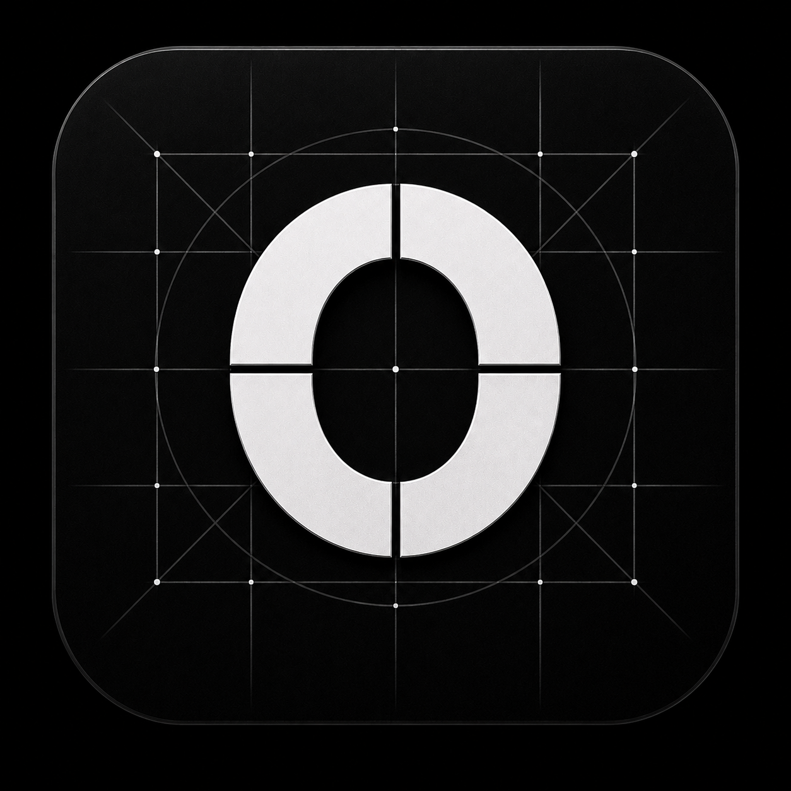
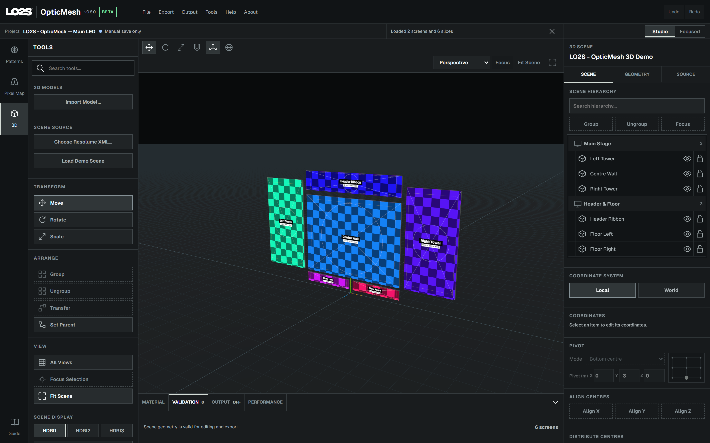

<p align="center">
  
</p>

# LO2S - OpticMesh

**Build your LED layout. Check the pixel map. Preview your visuals on stage.**

OpticMesh is a free, open-source companion for visual artists, LED technicians and production designers. Turn a Resolume Advanced Output map into physically sized LED surfaces, place them within an imported stage design, and preview patterns or live visuals from your chosen camera angle. You can also create calibration patterns and export the maps and geometry needed by the rest of your workflow.

**New preview: v0.8.0 Beta · Windows x64**

[Download v0.8.0 Beta](https://github.com/johnjjdave/opticmesh/releases/tag/v0.8.0) · [User manual](MANUAL.md) · [Changelog](CHANGELOG.md)



## One workflow, three workspaces

### Patterns — prepare and calibrate your display

Create test patterns at the resolution your display needs, in **Planar, Dome or Cubemap** formats. Link physical wall dimensions, pixel pitch, raster resolution and cabinet sizes; add metric grids, cabinet IDs, colour bars, grayscale, pixel checks, centre marks, safe areas, guides and your own logo.

Inspect at actual pixel size, run an automatic test sequence, and export native-resolution PNG files. Patterns can be used on their own without a Resolume map.

### Pixel Map — make your Resolume layout readable

Import **Resolume Advanced Output XML** to inspect the input composition and each screen's output map. Configure slice names, resolution and size labels, colour coding, guides and logos globally or for selected slices. Choose a continuous pattern across the map or a separate pattern for each slice.

Export input/output maps or selected slices as PNGs. In Windows, link an XML preset for automatic refresh and send generated content through NDI or Spout.

### 3D — see your screens in context

Build a physically scaled preview from your Resolume slices and add an imported stage model around them. The focus is practical visual simulation: understand screen placement, stage proportions and how the content reads from different viewpoints.

- **Stage-model import:** MVR, GDTF mesh geometry, FBX, OBJ, glTF/GLB, 3DS, Collada/DAE and STL. USD-family import is experimental; see [format support](MANUAL.md#stage-model-import-v080).
- **One scene hierarchy:** select, rename, group, reparent, hide and lock imported objects alongside your LED layout. Mixed groups can contain both imported parts and slices; Resolume slices remain protected from deletion.
- **Precise placement:** Move, Rotate and Scale, editable pivots, local/world coordinates, arithmetic input, one-metre snapping and Undo/Redo. **Transfer** matches position and orientation to a reference object without changing the source pivot.
- **LED geometry:** physical pixel pitch, extrusion and curved screen surfaces.
- **Materials:** diffuse colour/intensity, metallic, roughness, specular, wireframe display and three hidden HDRI reflection looks. LED extrusion materials remain independent of display content.
- **Camera views:** Perspective, Top, Right, Front and four-pane All Views, with Fit Scene and Focus Selection. Camera positions are retained when switching workspaces.
- **3Dconnexion SpaceMouse:** navigate the main 3D viewport alongside the regular mouse. Object mode uses the selected model, group or slice as its rotation reference. Requires the 3DxWare Windows driver.
- **Live sources:** patterns, video devices, NDI and Spout, with scene-wide or per-slice routing. Native NDI/Spout I/O requires Windows.
- **Scene exports:** GLB, glTF, OBJ, MVR mesh packages, STL and USDZ. Preservation of hierarchy, materials and units depends on the format.

## Floating Preview — keep a preview above your show software

In 3D mode, **Output → Floating Preview** opens an **always-on-top, camera-only preview** that stays live while you work elsewhere. Drag its top-left handle to position it and the bottom-right corner to resize it. Inside the preview, left-drag orbits, right-drag pans and the wheel zooms. You cannot accidentally edit objects there.

The preview keeps its own camera while receiving scene, material, map-style and live-source updates. It stays open when you switch to Patterns or Pixel Map. **Pause main viewport** stops drawing the main 3D view while the preview continues.

## Save, share and troubleshoot

Save your work in a **`.lo2s` project**, including imported model geometry. **File → Compile Project** collects the project, Resolume XML and input/output PNG maps into a named folder.

The Windows app maintains startup and recovery saves. Use **File → Open Recent** to reopen one of your six most recently used projects. OpticMesh asks before replacing unsaved work and offers **Save**, **Quit without saving**, or **Cancel** when closing. Projects reopen on Pattern Generator so you can reconnect live inputs deliberately.

**Performance** distinguishes interface FPS, viewport redraws and scene/drawn triangle counts. The Windows app adds CPU and memory readings, with GPU/VRAM telemetry on supported NVIDIA systems. Load colours help identify pressure; see the manual for each reading's scope.

## Getting started

1. Install the [v0.8.0 Beta](https://github.com/johnjjdave/opticmesh/releases/tag/v0.8.0)
2. Create a pattern or import a Resolume Advanced Output XML file in **Pixel Map**.
3. Set your LED product's pixel pitch and check its physical dimensions.
4. Switch to **3D**, import stage geometry if needed, and position your screens.
5. Choose your source, frame the preview, and save a named project before exporting.

Open **Guide** or **Help → OpticMesh Manual** for the searchable, illustrated manual. Keyboard shortcuts are included in the same guide, with adjustable text size and enlarged screenshots.

## Windows and web availability

Development from v0.8.0 onward focuses on Windows. The hosted web app remains at v0.7.0; it will not receive the new desktop features.

| Capability | Windows v0.8.0 Beta | Hosted web v0.7.0 |
| --- | --- | --- |
| Patterns, Resolume maps and LED scene layout | Yes | Yes |
| Imported stage models and material controls | Yes | Not in the hosted stable release |
| NDI / Spout input and output | Yes | No |
| Always-on-top Floating Preview | Yes | No |
| Managed startup and recovery saves | Yes | No — save projects manually |

The Windows x64 installer includes the official NDI Runtime prerequisite when a compatible runtime is absent; NDI Tools is not required. The installer is unsigned. Windows may show an unknown-publisher prompt; use the official release and its `SHA256SUMS.txt` to verify your download.

```text
Documents\OpticMesh\
├── Projects\
│   ├── Startup Project.lo2s
│   └── Startup Project.previous.lo2s
├── Exports\
└── Test Patterns\
```

**Projects** holds named projects and recovery files; **Exports** is the default for 3D exports; **Test Patterns** is the default for PNG maps and patterns. Ctrl+S updates a named project, or opens Save As for the startup project.

## Compatibility and scope

- v0.8.0 is a beta preview. Keep a separate copy of projects you need to reopen in v0.7.0; projects containing imported models require v0.8.0 or later.
- Imported models are static geometry. Fixture lighting simulation, animation playback, polygon reduction and Technical Plots are not included in this release.
- Import units and format capabilities matter. OBJ and STL require a source-unit choice; MVR uses its defined units. Review the manual before exchanging files with another application.
- 3D NDI/Spout output is 1920 × 1080, targeting 30 fps; achievable performance depends on the scene, sources and system. PNG exports retain their configured native resolution.
- Projects and media processing stay local. Desktop update checks contact GitHub; NDI exchanges frames over the network. See the [privacy and release policy](CODE_SIGNING_POLICY.md).

## Feedback and contributions

[Report a bug or request a feature](https://github.com/johnjjdave/opticmesh/issues). Include the version, steps to reproduce and expected result. Share only files you have permission to publish.

For development setup, validation and Windows builds, see [CONTRIBUTING.md](CONTRIBUTING.md), [RELEASING.md](RELEASING.md) and the [native bridge README](native/README.md).

## License and credits

OpticMesh source code is available under the [MIT License](LICENSE). Bundled third-party components and artwork retain their own licenses; see [Third-party notices](THIRD_PARTY_NOTICES.md). The HDRI assets are included with redistribution permission and are not covered by OpticMesh's MIT License.

LO2S and its logo identify the official publisher. Resolume and its mark belong to their respective owner. NDI® is a registered trademark of Vizrt NDI AB.
