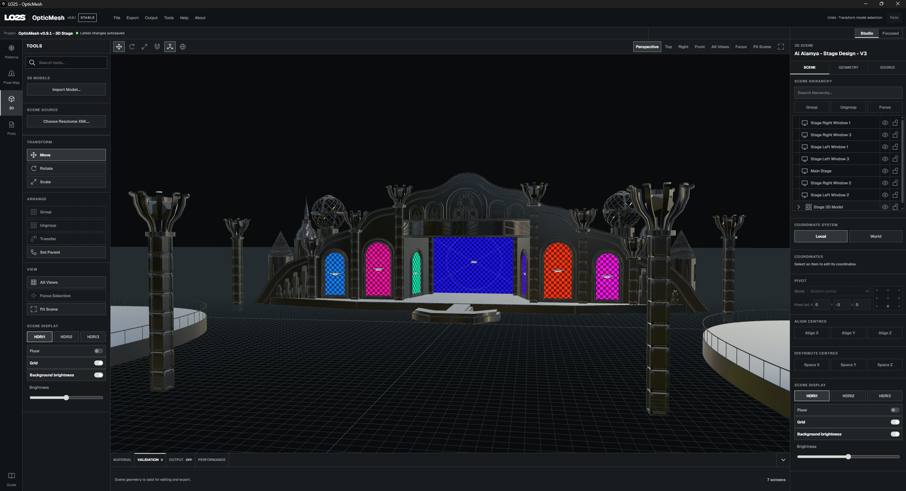

<p align="center">
  
</p>

# LO2S - OpticMesh

**Check your pixel map. Simulate your stage. Deliver clear technical plots.**

OpticMesh is a free companion for visual artists, LED technicians and production designers. Turn a Resolume Advanced Output map into physically sized LED surfaces, place them within an imported stage design, and preview patterns or live visuals from your chosen camera angle. Prepare branded A3 technical plots from that verified layout, with coordinates, dimensions, panel specifications and scene views. Patterns remains a supporting mode for calibration and content checks.

**Latest: v0.9.2 Beta · Windows x64**

[Download v0.9.2 Beta](https://github.com/johnjjdave/opticmesh/releases/tag/v0.9.2) · [Changelog](CHANGELOG.md)



## One workflow, four workspaces

The production flow is **Resolume Pixel Map → 3D Simulation → Technical Plots**. Use Patterns whenever you need standalone calibration images.

### Patterns — prepare and calibrate your display

Create test patterns at the resolution your display needs, in **Planar, Dome or Cubemap** formats. Link physical wall dimensions, pixel pitch, raster resolution and cabinet sizes; add metric grids, cabinet IDs, colour bars, grayscale, pixel checks, centre marks, safe areas, guides and your own logo.

Inspect at actual pixel size, run an automatic test sequence, and export native-resolution PNG files. Patterns can be used on their own without a Resolume map.

### Pixel Map — make your Resolume layout readable

Import **Resolume Advanced Output XML** to inspect the input composition and each screen's output map. Configure slice names, resolution and size labels, colour coding, guides and logos globally or for selected slices. Choose a continuous pattern across the map or a separate pattern for each slice.

Export input/output maps or selected slices as PNGs. Link an XML preset for automatic refresh and send generated content through NDI or Spout.

- **OpticMesh Map for Resolume:** the included FFGL source receives Pixel Map updates on the same computer without a continuous Spout or NDI stream. It keeps showing the map while you work in other modes and retains the last image after OpticMesh closes.
- **After Effects:** export a project builder with one editable composition per slice, linked into the full input map and per-screen input/output compositions.
- **TouchDesigner:** export a starter project with direct TOP inputs for the full map and individual slices, linked map outputs, and Spout/NDI switches.

### 3D — see your screens in context

Build a physically scaled preview from your Resolume slices and add an imported stage model around them. The focus is practical visual simulation: understand screen placement, stage proportions and how the content reads from different viewpoints.

- **Stage-model import:** MVR, GDTF mesh geometry, FBX, OBJ, glTF/GLB, 3DS, Collada/DAE and STL. USD-family import is experimental; see format support in the in-app guide.
- **One scene hierarchy:** select, rename, group, reparent, hide and lock imported objects alongside your LED layout. Mixed groups can contain both imported parts and slices; Resolume slices remain protected from deletion.
- **Precise placement:** Move, Rotate and Scale, editable pivots, local/world coordinates, arithmetic input, one-metre snapping and Undo/Redo. **Transfer** matches position and orientation to a reference object without changing the source pivot.
- **LED geometry:** physical pixel pitch, extrusion and curved screen surfaces.
- **Materials:** diffuse colour/intensity, metallic, roughness, specular, wireframe display and three hidden HDRI reflection looks. LED extrusion materials remain independent of display content.
- **Camera views:** Perspective, Top, Right, Front and four-pane All Views, with Fit Scene and Focus Selection. Camera positions are retained when switching workspaces.
- **3Dconnexion SpaceMouse:** navigate the main 3D viewport alongside the regular mouse. Object mode uses the selected model, group or slice as its rotation reference. Requires the 3DxWare Windows driver.
- **Live sources:** patterns, video devices, NDI and Spout, with scene-wide or per-slice routing. Adjust brightness, gamma, contrast and highlight protection directly in the Source panel. Native NDI/Spout I/O requires Windows.
- **Scene exports:** GLB, glTF, OBJ, MVR mesh packages, STL and USDZ. Preservation of hierarchy, materials and units depends on the format.

### Technical Plots — prepare the handover

Create fixed **A3 landscape** sheets with your own logo and title block. Combine input/output maps, screen details, specifications, orthographic or isometric stage views, and delivery notes.

- **Mapping information:** slice names and IDs, input or output coordinates, pixel dimensions, physical sizes, pixel pitch and panel sizes/raster.
- **Page layout:** place, drag, resize and copy frames with grid snapping, alignment guides and millimetre spacing. Reorder sheets and save reusable templates to Documents/OpticMesh/Exports/Templates for use across updates.
- **View framing:** choose the camera and render style, then pan or zoom inside each frame. Each view refreshes when its settings change.
- **Typography:** adjustable fonts and sizes, with bold, italic, underline and alignment for note frames.
- **Delivery:** export PDF or preview and print on your printer's paper size with Fit to printable area. Long specification tables continue onto additional pages.

Scene views use parallel projection and are labelled **Not to scale**. Review the printed measurements rather than measuring stage geometry from the page.

## Floating Preview — keep a preview above your show software

In 3D mode, **Output → Floating Preview** opens an **always-on-top, camera-only preview** that stays live while you work elsewhere. Drag its top-left handle to position it and the bottom-right corner to resize it. Inside the preview, left-drag orbits, right-drag pans and the wheel zooms. You cannot accidentally edit objects there.

The preview keeps its own camera while receiving scene, material, map-style and live-source updates. It stays open when you switch to Patterns, Pixel Map or Plots. **Pause main viewport** stops drawing the main 3D view while the preview continues.

## Save, share and troubleshoot

Save your work in a **`.lo2s` project**, including imported model geometry and editable plot sheets. **File → Compile Project** collects the project, Resolume XML and input/output PNG maps into a named folder. Export the finished plots separately as PDF.

The Windows app maintains startup and recovery saves. Use **File → Open Recent** to reopen one of your six most recently used projects. OpticMesh asks before replacing unsaved work and offers **Save**, **Quit without saving**, or **Cancel** when closing. Projects reopen on Pattern Generator so you can reconnect live inputs deliberately.

**Performance** distinguishes interface FPS, viewport redraws and scene/drawn triangle counts. The Windows app adds CPU and memory readings, with GPU/VRAM telemetry on supported NVIDIA systems. Load colours help identify pressure; see the manual for each reading's scope.

## Getting started

1. Install [OpticMesh 0.9.2 Beta for Windows](https://github.com/johnjjdave/opticmesh/releases/tag/v0.9.2).
2. Create a pattern or import a Resolume Advanced Output XML file in **Pixel Map**.
3. Set your LED product's pixel pitch and check its physical dimensions.
4. Switch to **3D**, import stage geometry if needed, and position your screens.
5. Choose your source and verify the 3D arrangement.
6. Open **Plots**, prepare your sheets, and check labels, dimensions and view framing.
7. Save a named project, then export the PDF and any required map or 3D files.

Try **File → Open Demo** for a complete stage with mapped LED slices and technical plots. The installer includes the matching Resolume Advanced Output preset in your Documents folders for Arena and Avenue, and a copy in Documents/OpticMesh/Demos.

Each release includes its own searchable, illustrated guide. Open **Guide** or **Help → OpticMesh Manual** inside the app for instructions matching your installed version. Keyboard shortcuts are included in the same guide, with adjustable text size and enlarged screenshots.

## Windows installation

OpticMesh is a Windows x64 application. Download the executable installer from the official GitHub releases.

The Windows x64 installer includes the official NDI Runtime prerequisite when a compatible runtime is absent; NDI Tools is not required. The installer is unsigned. Windows may show an unknown-publisher prompt; use the official release and its `SHA256SUMS.txt` to verify your download.

```text
Documents\OpticMesh\
├── Projects\
│   ├── Startup Project.lo2s
│   └── Startup Project.previous.lo2s
├── Exports\
│   └── Templates\
└── Test Patterns\
```

**Projects** holds named projects and recovery files; **Exports** is the default for 3D exports and Technical Plots PDFs; **Test Patterns** is the default for PNG maps and patterns. Ctrl+S updates a named project, or opens Save As for the startup project.

## Compatibility and scope

- v0.9.2 is the latest Windows Beta. Keep a separate copy of projects you need to reopen in older versions; Technical Plots requires v0.9.0 or later.
- Imported models are static geometry. Fixture lighting simulation, animation playback, polygon reduction are not included in this release.
- Import units and format capabilities matter. OBJ and STL require a source-unit choice; MVR uses its defined units. Review the manual before exchanging files with another application.
- 3D NDI/Spout output is 1920 × 1080, targeting 30 fps; achievable performance depends on the scene, sources and system. PNG exports retain their configured native resolution.
- Projects and media processing stay local. Desktop update checks contact GitHub; NDI exchanges frames over the network. See the [privacy and release policy](CODE_SIGNING_POLICY.md).

## Feedback

[Report a bug or request a feature](https://github.com/johnjjdave/opticmesh/issues). Include the version, steps to reproduce and expected result. Share only files you have permission to publish.

Share official download links when recommending OpticMesh to others.

## License and credits

OpticMesh Standard is free for personal and commercial work under the [Standard licence](LICENSE), owned by LO2S Event Organizers - FZCO. The terms restrict redistribution, resale and modification of the proprietary application, while allowing you to edit, share and commercially deliver your own projects and exports. A future Pro edition may have separate paid terms.

Existing published releases retain their original licences; the Standard licence does not revoke earlier MIT grants. Bundled third-party components and artwork retain their own terms; see [Third-party notices](THIRD_PARTY_NOTICES.md). HDRI redistribution permission does not grant users unrestricted redistribution of those assets.

LO2S and its logo identify the official publisher. Resolume and its mark belong to their respective owner. NDI® is a registered trademark of Vizrt NDI AB.
